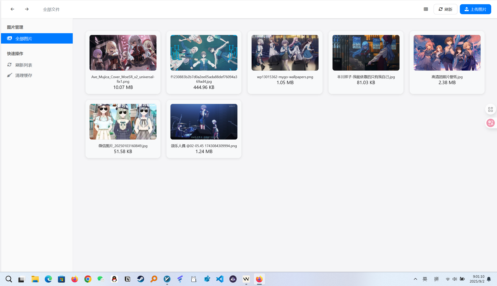

# Telegraph-Image

免费图片托管解决方案，Flickr/imgur 替代品。使用 Cloudflare Pages 和 Telegraph。

[English](README-EN.md)|中文

> [!IMPORTANT]
>
> 由于原有的Telegraph API接口被官方关闭，需要将上传渠道切换至Telegram Channel，请按照文档中的部署要求设置`TG_Bot_Token`和`TG_Chat_ID`，否则将无法正常使用上传功能。

## 如何获取Telegram的`Bot_Token`和`Chat_ID`

如果您还没有Telegram账户，请先创建一个。接着，按照以下步骤操作以获取`BOT_TOKEN`和`CHAT_ID`：

1. **获取`Bot_Token`**
   - 在Telegram中，向[@BotFather](https://t.me/BotFather)发送命令`/newbot`，根据提示依次输入您的机器人名称和用户名。成功创建机器人后，您将会收到一个`BOT_TOKEN`，用于与Telegram API进行交互。
   


2. **设置机器人为频道管理员**
   - 创建一个新的频道（Channel），进入该频道后，选择频道设置。将刚刚创建的机器人添加为频道管理员，这样机器人才能发送消息。


   


3. **获取`Chat_ID`**
   - 通过[@VersaToolsBot](https://t.me/VersaToolsBot)获取您的频道ID。向该机器人发送消息，按照指示操作，最后您将得到`CHAT_ID`（即频道的ID）。
   - 或者通过[@GetTheirIDBot](https://t.me/GetTheirIDBot)获取您的频道ID。向该机器人发送消息，按照指示操作，最后您将得到`CHAT_ID`（即频道的ID）。

   

最后去Cloudflare Pages后台设置相关的环境变量（注：修改环境变量后，需要重新部署才能生效）
| 环境变量        | 示例值                    | 说明                                                                                   |
|-----------------|---------------------------|----------------------------------------------------------------------------------------|
| `TG_Bot_Token`   | `123468:AAxxxGKrn5`        | 从[@BotFather](https://t.me/BotFather)获取的Telegram Bot Token。                        |
| `TG_Chat_ID`     | `-1234567`                 | 频道的ID，确保TG Bot是该频道或群组的管理员。 |

## 如何部署

### 提前准备

你唯一需要提前准备的就是一个 Cloudflare 账户 （如果需要在自己的服务器上部署，不依赖 Cloudflare，可参考[#46](https://github.com/cf-pages/Telegraph-Image/issues/46) ）

### 手把手教程

简单 3 步，即可部署本项目，拥有自己的图床

1.Fork 本仓库 (注意：必须使用 Git 或者 Wrangler 命令行工具部署后才能正常使用，[文档](https://developers.cloudflare.com/pages/functions/get-started/#deploy-your-function))

2.打开 Cloudflare Dashboard，进入 Pages 管理页面，选择创建项目，选择`连接到 Git 提供程序`


3. 按照页面提示输入项目名称，选择需要连接的 git 仓库，点击`部署站点`即可完成部署

## 特性

1.无限图片储存数量，你可以上传不限数量的图片

2.无需购买服务器，托管于 Cloudflare 的网络上，当使用量不超过 Cloudflare 的免费额度时，完全免费

3.无需购买域名，可以使用 Cloudflare Pages 提供的`*.pages.dev`的免费二级域名，同时也支持绑定自定义域名

4.支持图片审查 API，可根据需要开启，开启后不良图片将自动屏蔽，不再加载

5.支持后台图片管理，可以对上传的图片进行在线预览，添加白名单，黑名单等操作

### Finder 功能

二次开发，推出了 `finder` 界面。这个界面不仅在视觉上更加现代化，还带来了许多实用的新功能，旨在提升您的图片管理体验。



**主要特性包括：**

*   **现代化的文件管理界面**：重新设计了整个界面，使其更直观、更易于使用。现在，您可以更轻松地浏览和管理您的图片。
*   **文件夹管理功能**：支持创建自定义文件夹，对图片进行分类管理。支持拖拽上传到指定文件夹，提供完整的文件夹导航体验。
*   **后台上传与软进度条**：引入了后台上传功能，支持多文件并发上传。上传过程将在右下角通过一个非阻塞的“软”进度条显示，您可以在上传期间继续浏览和管理其他图片，无需等待。
*   **右键菜单**：为了提高操作效率，为每个图片添加了右键菜单。现在，您只需右键点击任何图片，即可快速访问复制链接、下载和删除等常用功能。
*   **URL路由支持**：支持深度链接，可以通过URL直接访问特定功能，如 `/finder/#new` 自动打开新建文件夹界面。
*   **安全认证保护**：内置Basic Authentication认证机制，保护文件管理界面的安全访问。

#### Finder 访问与认证

Finder功能需要认证才能访问，确保您的文件管理安全：

**访问地址：** `https://your-domain.pages.dev/finder/`

**认证配置：** 在Cloudflare Pages环境变量中设置：
- `FINDER_ENABLED=true` - 启用Finder功能
- `FINDER_USER=your_username` - 设置用户名
- `FINDER_PASS=your_password` - 设置密码

**快捷功能：**
- 新建文件夹：`https://your-domain.pages.dev/finder/#new`
- 文件夹导航：支持面包屑导航和侧边栏快速切换


## 二次开发指南

Telegraph-Image 项目采用模块化设计，支持灵活的二次开发和功能扩展。

### 项目架构

```
Telegraph-Image/
├── functions/              # Cloudflare Pages Functions
│   ├── api/                # API 端点
│   │   ├── manage/         # 图片管理 API
│   │   └── finder/         # Finder 功能 API
│   ├── file/               # 文件访问处理
│   └── upload.js           # 图片上传处理
├── finder/                 # Finder 文件管理界面
│   ├── index.html          # 主界面文件
│   ├── styles.css          # 样式文件
│   └── middleware/         # 认证中间件
└── admin.html              # 传统管理界面
```

### 核心功能模块

#### 1. 文件夹管理系统
- **位置**: `functions/api/manage/folders-enhanced.js`
- **功能**: 提供文件夹的CRUD操作，支持多层级文件夹结构
- **数据存储**: 使用Cloudflare KV存储文件夹元数据

#### 2. 认证中间件
- **位置**: `functions/finder/_middleware.js`
- **功能**: Basic Authentication认证保护
- **配置**: 支持环境变量配置用户名密码

#### 3. 前端界面
- **位置**: `finder/index.html`
- **技术栈**: 原生JavaScript + CSS3
- **特性**: 响应式设计、拖拽上传、实时预览

### 开发环境设置

#### 1. 本地开发
```bash
# 克隆项目
git clone https://github.com/cf-pages/Telegraph-Image.git
cd Telegraph-Image

# 安装依赖
npm install

# 启动开发服务器
npx wrangler pages dev . --port 8788
```

#### 2. 环境变量配置
创建 `wrangler.toml` 文件：
```toml
name = "telegraph-image"
compatibility_date = "2023-12-01"

[env.development.vars]
FINDER_ENABLED = "true"
FINDER_USER = "admin"
FINDER_PASS = "your_password"
TG_Bot_Token = "your_bot_token"
TG_Chat_ID = "your_chat_id"

[[env.development.kv_namespaces]]
binding = "img_url"
id = "your_kv_namespace_id"
```

### 自定义开发

#### 1. 添加新的API端点
在 `functions/api/` 目录下创建新的JavaScript文件：
```javascript
// functions/api/custom/example.js
export async function onRequest(context) {
    const { request, env } = context;

    // 你的自定义逻辑
    return new Response(JSON.stringify({
        message: "Custom API endpoint"
    }), {
        headers: { "Content-Type": "application/json" }
    });
}
```

#### 2. 扩展Finder界面
修改 `finder/index.html` 添加新功能：
```javascript
// 添加新的功能类
class CustomFeature {
    constructor() {
        this.init();
    }

    init() {
        // 初始化自定义功能
    }
}

// 在主应用中集成
window.customFeature = new CustomFeature();
```

#### 3. 自定义认证机制
修改 `functions/finder/_middleware.js` 实现自定义认证：
```javascript
// 自定义认证函数
function customAuthentication(context) {
    // 实现你的认证逻辑
    // 例如：JWT验证、OAuth集成等
}

export const onRequest = [errorHandling, customAuthentication];
```

### 部署与发布

#### 1. 生产环境部署
```bash
# 构建项目
npm run build

# 部署到Cloudflare Pages
npx wrangler pages deploy
```

#### 2. 环境变量设置
在Cloudflare Pages控制台设置生产环境变量：
- `FINDER_ENABLED=true`
- `FINDER_USER=your_secure_username`
- `FINDER_PASS=your_secure_password`
- `TG_Bot_Token=your_telegram_bot_token`
- `TG_Chat_ID=your_telegram_chat_id`

### 常见开发场景

#### 1. 添加新的文件类型支持
修改 `functions/upload.js` 中的文件类型检查：
```javascript
const allowedTypes = /jpeg|jpg|png|gif|webp|svg|pdf|doc|docx|txt|mp4|avi|mov|your_new_type/;
```

#### 2. 自定义文件夹样式
修改 `finder/styles.css` 添加新的样式：
```css
.custom-folder-style {
    /* 你的自定义样式 */
}
```

#### 3. 集成第三方服务
在相应的API文件中添加第三方服务调用：
```javascript
// 例如：集成图片处理服务
const processedImage = await thirdPartyService.process(imageData);
```

### 贡献指南

1. **Fork项目** - 从主仓库fork一份代码
2. **创建分支** - 为你的功能创建新分支
3. **开发测试** - 在本地环境开发并测试
4. **提交PR** - 提交Pull Request到主仓库

### 技术支持

- **文档**: 查看项目Wiki获取详细文档
- **Issues**: 在GitHub Issues中报告问题或请求功能
- **讨论**: 在GitHub Discussions中参与技术讨论

### 绑定自定义域名

在 pages 的自定义域里面，绑定 cloudflare 中存在的域名，在 cloudflare 托管的域名，自动会修改 dns 记录


### 开启图片审查

1.请前往https://moderatecontent.com/ 注册并获得一个免费的用于审查图像内容的 API key

2.打开 Cloudflare Pages 的管理页面，依次点击`设置`，`环境变量`，`添加环境变量`

3.添加一个`变量名称`为`ModerateContentApiKey`，`值`为你刚刚第一步获得的`API key`，点击`保存`即可

注意：由于所做的更改将在下次部署时生效，你或许还需要进入`部署`页面，重新部署一下该本项目

开启图片审查后，因为审查需要时间，首次的图片加载将会变得缓慢，之后的图片加载由于存在缓存，并不会受到影响


### 限制

1.由于图片文件实际存储于 Telegraph，Telegraph 限制上传的图片大小最大为 5MB

2.由于使用 Cloudflare 的网络，图片的加载速度在某些地区可能得不到保证

3.Cloudflare Function 免费版每日限制 100,000 个请求（即上传或是加载图片的总次数不能超过 100,000 次）如超过可能需要选择购买 Cloudflare Function 的付费套餐，如开启图片管理功能还会存在 KV 操作数量的限制，如超过需购买付费套餐

### 感谢

Hostloc @feixiang 和@乌拉擦 提供的思路和代码

## 更新日志
2024 年 7 月 6 日--后台管理页面更新

- 支持两个新的管理页面视图（网格视图和瀑布流）

    1、网格视图，感谢@DJChanahCJD 提交的代码
        支持批量删除/复制链接
        支持按时间倒序排序
        支持分页功能
        
    2、瀑布流视图，感谢@panther125 提交的代码
        

- 添加自动更新支持

    现在fork的项目能够自动和上游仓库同步最新的更改，自动实装最新的项目功能，感谢 @bian2022

    打开自动更新步骤：
        当你 fork 项目之后，由于 Github 的限制，需要手动去你 fork 后的项目的 Actions 页面启用 Workflows，并启用 Upstream Sync Action，启用之后即可开启每小时定时自动更新：
        
        
    `如果你遇到了 Upstream Sync 执行错误，请手动 Sync Fork 一次！`

    手动更新代码

    如果你想让手动立即更新，可以查看 [Github 的文档](https://docs.github.com/en/pull-requests/collaborating-with-pull-requests/working-with-forks/syncing-a-fork) 了解如何让 fork 的项目与上游代码同步。

    你可以 star/watch 本项目或者 follow 作者来及时获得新功能更新通知。
- 添加远端遥测

    可通过添加`disable_telemetry`环境变量退出遥测

2023 年 1 月 18 日--图片管理功能更新

1、支持图片管理功能，默认是关闭的，如需开启请部署完成后前往后台依次点击`设置`->`函数`->`KV 命名空间绑定`->`编辑绑定`->`变量名称`填写：`img_url` `KV 命名空间` 选择你提前创建好的 KV 储存空间，开启后访问 http(s)://你的域名/admin 即可打开后台管理页面
| 变量名称 | KV 命名空间 |
| ----------- | ----------- |
| img_url | 选择提前创建好的 KV 储存空间 |


2、后台管理页面新增登录验证功能，默认也是关闭的，如需开启请部署完成后前往后台依次点击`设置`->`环境变量`->`为生产环境定义变量`->`编辑变量` 添加如下表格所示的变量即可开启登录验证
| 变量名称 | 值 |
| ----------- | ----------- |
|BASIC_USER = | <后台管理页面登录用户名称>|
|BASIC_PASS = | <后台管理页面登录用户密码>|


当然你也可以不设置这两个值，这样访问后台管理页面时将无需验证，直接跳过登录步骤，这一设计使得你可以结合 Cloudflare Access 进行使用，实现支持邮件验证码登录，Microsoft 账户登录，Github 账户登录等功能，能够与你域名上原有的登录方式所集成，无需再次记忆多一组后台的账号密码，添加 Cloudflare Access 的方式请参考官方文档，注意需要保护路径包括/admin 以及 /api/manage/\*

3、新增图片总数量统计
当开启图片管理功能后，可在后台顶部查看记录中的图片数量


4、新增图片文件名搜索
当开启图片管理功能后，可在后台搜索框使用图片文件名称，快速搜索定位需要管理的图片


5、新增图片状态显示
当开启图片管理功能后，可在后台查看图片当前的状态{ "ListType": "None", "TimeStamp": 1673984678274 }
ListType 代表图片当前是否在黑白名单当中，None 则表示既不在黑名单中也不在白名单中，White 表示在在白名单中，Block 表示在黑名单中，TimeStamp 为图片首次加载的时间戳，如开启的图片审查 API，则这里还会显示图片审查的结果用 Label 标识


6、新增黑名单功能
当开启图片管理功能后，可在后台手动为图片加入黑名单，加入黑名单的图片将无法正常加载


7、新增白名单功能
当开启图片管理功能后，可在后台手动为图片加入白名单，加入白名单的图片无论如何都会正常加载，可绕过图片审查 API 的结果


8、新增记录删除功能
当开启图片管理功能后，可在后台手动删除图片记录，即不再后台显示该图片，除非有人再次上传并加载该图片，注意由于图片储存在 telegraph 的服务器上，我们无法删除上传的原始图片，只能通过上述第 6 点的黑名单功能屏蔽图片的加载

9、新增程序运行模式：白名单模式
当开启图片管理功能后，除了默认模式外，这次更新还新增了一项新的运行模式，在该模式下，只有被添加进白名单的图片才会被加载，上传的图片需要审核通过后才能展示，最大程度的防止不良图片的加载，如需开启请设置环境变量：WhiteList_Mode=="true"

10、新增后台图片预览功能
当开启图片管理功能后，可在后台预览通过你的域名加载过的图片，点击图片可以进行放大，缩小，旋转等操作


## 已经部署了的，如何更新？

其实更新非常简单，只需要参照上面的更新内容，先进入到 Cloudflare Pages 后台，把需要使用的环境变量提前设置好并绑定上 KV 命名空间，然后去到 Github 你之前 fork 过的仓库依次选择`Sync fork`->`Update branch`即可，稍等一会，Cloudflare Pages 那边检测到你的仓库更新了之后就会自动部署最新的代码了

## 一些限制：

Cloudflare KV 每天只有 1000 次的免费写入额度，每有一张新的图片加载都会占用该写入额度，如果超过该额度，图片管理后台将无法记录新加载的图片

每天最多 100,000 次免费读取操作，图片每加载一次都会占用该额度（在没有缓存的情况下，如果你的域名在 Cloudflare 开启了缓存，当缓存未命中时才会占用该额度），超过黑白名单等功能可能会失效

每天最多 1,000 次免费删除操作，每有一条图片记录都会占用该额度，超过将无法删除图片记录

每天最多 1,000 次免费列出操作，每打开或刷新一次后台/admin 都会占用该额度，超过将进行后台图片管理

绝大多数情况下，该免费额度都基本够用，并且可以稍微超出一点，不是已超出就立马停用，且每项额度单独计算，某项操作超出免费额度后只会停用该项操作，不影响其他的功能，即即便我的免费写入额度用完了，我的读写功能不受影响，图片能够正常加载，只是不能在图片管理后台看到新的图片了。

如果你的免费额度不够用，可以自行向 Cloudflare 购买 Cloudflare Workers 的付费版本，每月$5 起步，按量收费，没有上述额度限制

另外针对环境变量所做的更改将在下次部署时生效，如更改了`环境变量`，针对某项功能进行了开启或关闭，请记得重新部署。


### Sponsorship

This project is tested with BrowserStack.

This project is support by [Cloudflare](https://www.cloudflare.com/).
